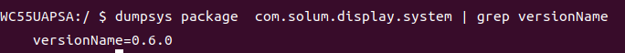

# SOLUM DeviceAPI Documentation

This repository contains the official documentation for the SOLUM DeviceAPI library, which provides system-level control capabilities for Android-based signage devices.

---

## 📄 API Documentation

👉 https://github.com/solum-signage-system/device_api_documents/blob/main/API_Doc.md

---

## 📌 Overview

The DeviceAPI library enables applications to access privileged system features such as:

- Device management
- Display control
- Power management
- Input handling
- System configuration

It is designed for kiosk and digital signage environments requiring strict control over device behavior.

---

## 🚀 Getting Started

### 1. Add GitHub Package Repository

Add the following to your `settings.gradle.kts`:

```kotlin
maven {
    name = "GitHubPackages"
    url = uri("https://maven.pkg.github.com/solum-signage-system/cms-system-controller")
    credentials {
        username = "YOUR_GITHUB_USERNAME"
        password = "YOUR_PERSONAL_ACCESS_TOKEN"
    }
}
```

> - Replace `username` with your GitHub username  
> - Replace `password` with your GitHub Personal Access Token  
> - See: https://docs.github.com/en/packages/working-with-a-github-packages-registry/working-with-the-gradle-registry  

---

### 2. Add Dependency

Add the dependency to your module:

```kotlin
implementation("com.solum.display:system-manager:{version}")
```

👉 Latest version:  
https://github.com/solum-signage-system/cms-system-controller/packages/2142218

---

### 3. Grant Required Permissions

To use the DeviceAPI, one of the following conditions must be met:

- Installed via CMS Play Wizard
- Explicitly granted permission using:

```bash
cmd solum.platform grant-system-acess
```

- Permission delegated via `Package.requestGrantSystemAccess`

---

### 4. Verify Installed Version (Optional)

```bash
adb shell dumpsys package com.solum.display.system | grep versionName
```


---

## 📢 Notes

- This API requires system-level privileges
- Not all features are available on standard Android devices
- Intended for internal use or authorized partners only
